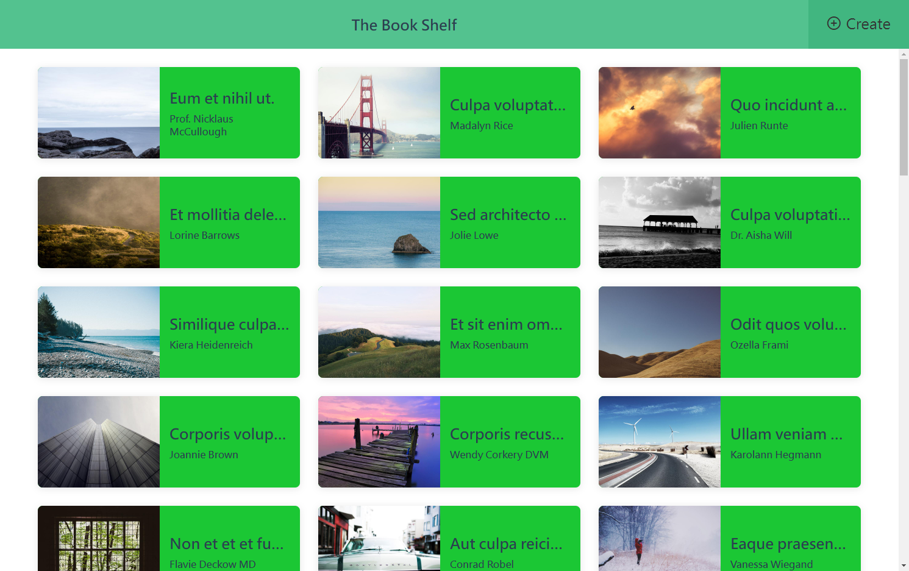

# IStaging 前端面試題目

---

iStaging 2D FrontEnd Engineer Assessment Test

## [Demo Page](https://andrew781026.github.io/istaging-interview/)

### 目前使用 Tech

> Tech

- 使用 vue ui 建立的腳手架
- vue3 + eslint with Standard + scss + TypeScript

> Tool

- [FlatIcon](https://www.flaticon.com/)
- [fantasticon - convert svg to font icon](https://github.com/tancredi/fantasticon#readme)

### 技術要求

- 用 Vue 2 / 3
- 使用 Vue Router 做分頁
- 使用 CSS 預處理器 or 後處理器 ( sass / postCSS )
- 使用 ESLint
- 需要能相容以下目標瀏覽器 < last 2 versions and > 1 % ( Browserslist query ) >

### 規格需求

#### 1️⃣ UI

- 參考 Figma - https://www.figma.com/file/jeP1aNnM8CHd20MRONce4A/2D-FE-Assessment
- 樣式 ( 配色 . 寬高 . 元件等等 ) 不限制 . 以實作功能為優先

#### 2️⃣ API

- 規格說明 : API Docs - https://demo.api-platform.com/docs
- 因 CORS 問題 , API 請求網址請加 Proxy 服務網址的前綴
  - https://cors-anywhere-dot-vr-cam-161603.uc.r.appspot.com/
  - e.g. GET https://cors-anywhere-dot-vr-cam-161603.uc.r.appspot.com/https://demo.api-platform.com/books
- 使用到的資料欄位 : 
  - ISBN 
  - 名稱 title 
  - 敘述 description 
  - 作者 author 
  - 出版日期 publicationDate
  - 圖書預覽圖請固定使用 : https://picsum.photos/800/600

#### 功能說明

#### 加分項目 ( 選擇性 )

1. 使用 Composition API
2. 使用 Nuxt.js & SSR 模式
3. 使用 TypeScript
4. 實作 SEO
5. 撰寫 Unit Test 
6. 首頁圖書列表實作無限滾動
7. 確保圖書列表載入超過 10,000 筆圖書資料後 , 不影響瀏覽體驗
8. 實作 CI/CD , 並將網站部屬至任一雲端代管服務中
9. 加入其他可以展現個人能力和知識的細節 ( 架構 . 程式碼風格 . UX ...等 )
